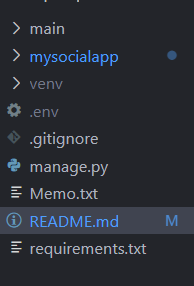

# Django Backend REST API - Windows

Kevyt testiympäristö sosiaalista mediaa muistuttavalle REST API

Tämä projekti on sosiaalisen median tyylinen sovellus, joka tarjoaa REST API -pohjaiset toiminnot. Sovellus on tarkoitettu testikäyttöön ja toimii parhaiten Windows-ympäristössä.

Sovelluksen tarkoituksena on tarjota CRUD-toiminnot postauksille, kommenteille ja käyttäjäprofiileille. Käyttämällä Django REST Frameworkia API toimii testiserverillä, jonka voi avata paikalliselle koneelle.
##
Dev Note : Jos haluat käyttää toista tietokantaa niin tee muutokset settings.py tiedostoon ja tee migraatio komennot.
Admin paneelin kautta voi lisätä tietueita suoraan tietokantaan, esim:Käyttäjiä, Julkaisuja ja kommentteja.
Näin api kutsujen testaus ja ohjelman testaus helpottuu.
##
Dev Note: Ohjelma sisältää perus-html-näkymän, testausta varten.
##

Asennus:

Kansio rakenne : Projekti taso.

Kloonaa repo uuteen kansioon jonka voit nimetä miten vain.
Kansion sisällä osoite kenttään cmd ja anna komento

    git clone <repon-url>

Avaa IDE antamalla komento.
    
    code .

Varmista että terminaalin polku on projekti tasolla : dir, näkyy:  manage.py
Luo virtuaali ympäristö IDE:n terminaalissa.

    python -m venv venv

Ja aktivoi virtuaaliympäristö IDE:n terminaalissa.

    Windows: venv\Scripts\activate

Asenna riippuvuudet
Varmista, että virtuaaliympäristö on aktivoitu ennen asennusta:

    pip install -r requirements.txt

Tietokannan migraatiot: sqlite oletus

    python manage.py makemigrations main
    python manage.py migrate

Käynnistä kehityspalvelin

    python manage.py runserver

Käyttöohjeet:

Avaa selain osoitteeseen:

    http://127.0.0.1:8000/api/ tai lisää muita päätepisteitä seuraavan kohdan mukaisesti.

API-päätepisteet

    ROOT: http://127.0.0.1:8000/api/
    Posts: http://127.0.0.1:8000/api/posts/
    Comments: http://127.0.0.1:8000/api/comments/
    Users: http://127.0.0.1:8000/api/users/
    Kirjaudu: http://127.0.0.1:8000/api/login/
    Uloskirjautuminen: http://127.0.0.1:8000/api/logout/

HUOM Tunnukset tarvitaan jotta kirjautumista voidaan kokeilla.
Luo tunnukset Admin paneelin kautta

    python manage.py createsuperuser

Admin ULR:

    http://127.0.0.1:8000/admin

Lisäasetukset: riippuen ohjelmasta jolla API kutsuja tehdään.

*Varaus*

*mahdolliset bugi korjaukset*

: Jani Pekkala 2024 